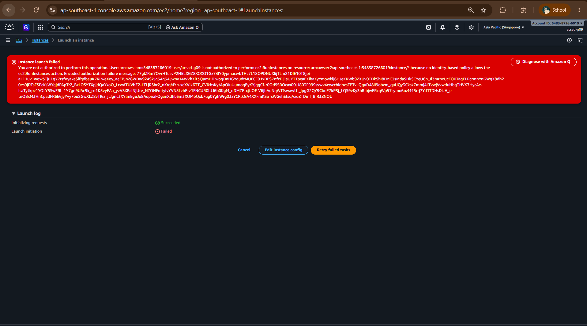
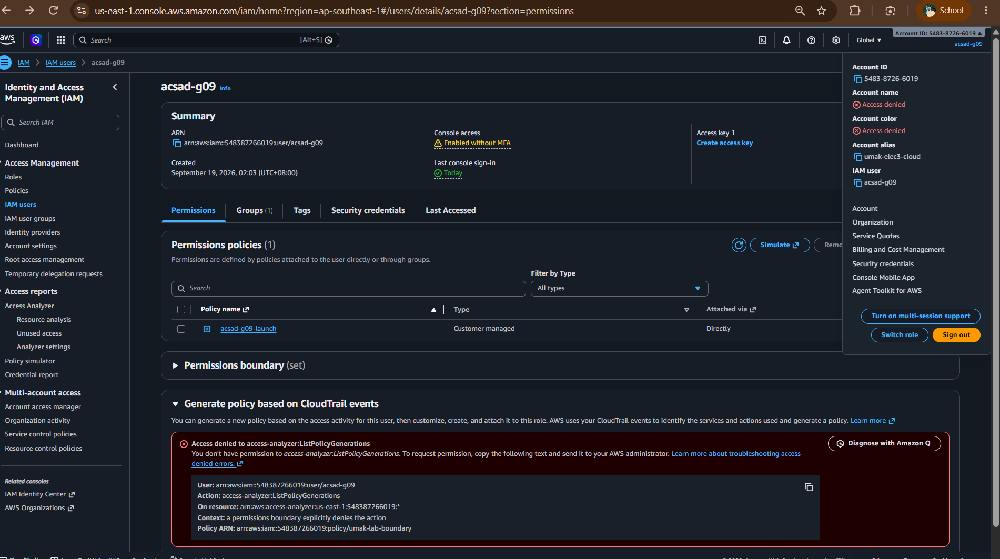
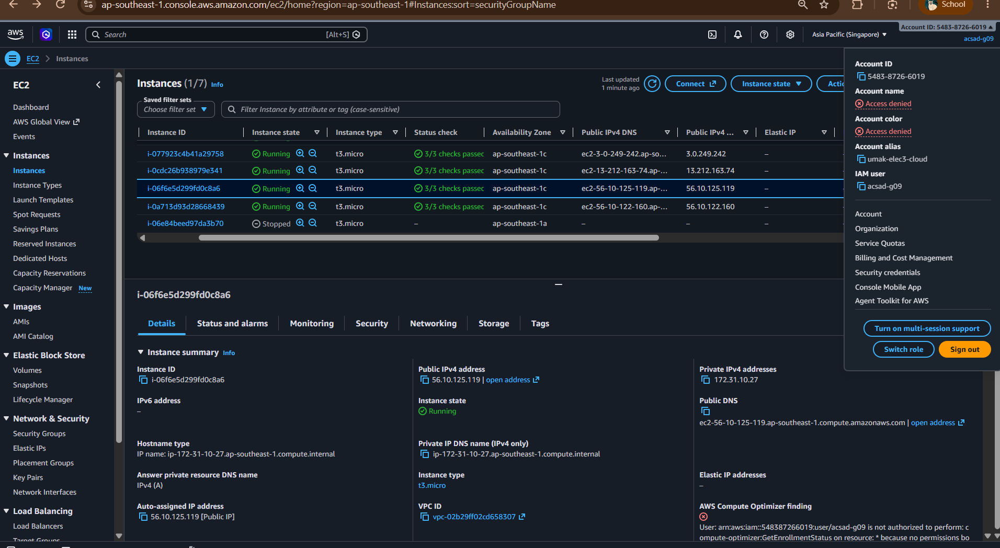
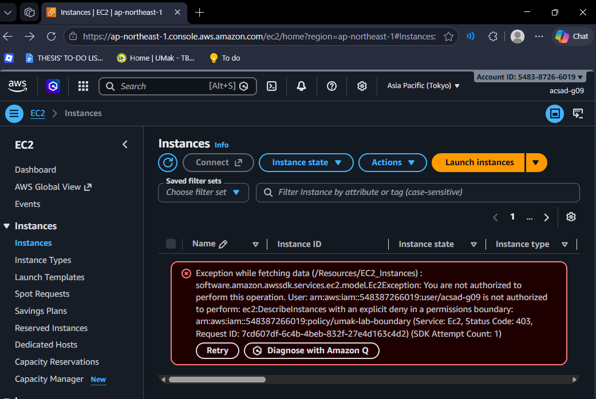
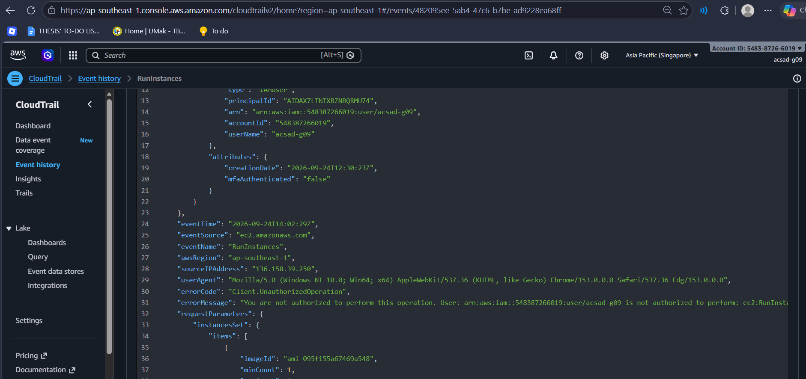

# Lab 1 Submission

## Part B
**Error Action Name:** ec2:RunInstances

**Screenshot (Part B launch denial with username visible):**

## Part C
**Policy Statement Blanks:**
- `"Action"`: ec2:RunInstances
- `"Resource"`: ap-southeast-1:548387266019:instance/
- `"ec2:InstanceType"`: t3.micro

## Part D
**Security Group Error Text:** You are not authorized to perform this operation. User: arn:aws:iam::548387266019:user/acsad-g09 is not authorized to perform: ec2:CreateSecurityGroup on resource: arn:aws:ec2:ap-southeast-1:548387266019:security-group/* because no identity-based policy allows the ec2:CreateSecurityGroup action. Encoded authorization failure message: Votd7nG7T3cU6BK5l--o8amPmUEFsCigRQC2KGBjvVaCfunwUxfmLEubjmV3dREFrESCUH41DvUAMCJKyfgfGLJIxbNe2T0qpuLBDJ8zzIKG6V4tZmdBlkb4IwygRM3zzWbiEc64tx-YY9wZxwJo713smC9xAqUlxMnQCUJlSBlJvATRo0GGftDuumr2vBfImgwMTVXvYAJGXpz5JuZhIjHIUa42Y-i1-zRFMoFN9xRPiJ6A79bIpZNwMAyW1-glKZNSed97UGvl_LEQvYUw-c8LrlRz55eVnr1UmaWmFkg5DKgK2npZwzgqVGdUte5rS3rciG84hauLz03GP3WUPIUjHRNM1fBlduuznlVaJWCSiytmFfTy25KPvFuPjnQU-e7pJRlMwZ7BMh52PIcywvnFSn_7LwNemUgwUztVrZKxO8ISH1K8LwC95Yw2kdB3oohZkiMk_5KNjGnhf8x-2ZMYe8mAHZppXc8gZt4uv3UbpDBgwOljUgPR6XIuU34MejWTqPy29HBnyaHljWUbAAAHqV-p10W4blGJsuvW5A

**Running Instance Time:** 09/24/2026 9:04PM"

**Screenshot 1 (Permissions tab listing <user>-launch):**

**Screenshot 2 (Instance in Running state):**

C:\Users\Mecailla\Downloads\part-d-instance.png
## Part E
**t3.small / Tokyo Denial Error:** Exception while fetching data (/Resources/EC2_Instances) : software.amazon.awssdk.services.ec2.model.Ec2Exception: You are not authorized to perform this operation. User: arn:aws:iam::548387266019:user/acsad-g09 is not authorized to perform: ec2:DescribeInstances with an explicit deny in a permissions boundary: arn:aws:iam::548387266019:policy/umak-lab-boundary (Service: Ec2, Status Code: 403, Request ID: 7cd607df-6c4b-4beb-832f-27e4d163c4d2) (SDK Attempt Count: 1)

**Screenshot 1 (t3.small or Tokyo denial):**

**Screenshot 2 (CloudTrail event showing errorMessage):**

## Part F Questions
1. Which action did the Part B error name?
   ec2:RunInstances
2. In your policy, which condition limits `ec2:RunInstances`?
   The Condition in the RunOnlyT3MicroInstances statement: "StringEquals": { "ec2:InstanceType": "t3.micro" } 
3. After you attached `ec2:*` on `*`, why was `t3.small` still denied? Name the boundary statement.
   The permissions boundary's DenyAnyInstanceTypeButT3Micro statement explicitly denies ec2:RunInstances whenever ec2:InstanceType is not t3.micro. An explicit Deny in the boundary always overrides any Allow in the identity policy, so ec2:* on * couldn't bypass it
4. Why is `ec2:*` on `*` a poor policy even with a boundary?
   It grants far more access than the task requires (e.g., managing or deleting other users' security groups and instances), relying entirely on the boundary as the only guardrail. The boundary doesn't restrict actions to only your own tagged resources — that isolation only exists because of the scoped, tag-conditioned statements in your own policy, which ec2:* on * discards.
5. In two sentences: what does the boundary control that your policy cannot?
   The boundary enforces account-wide limits that apply no matter what your own policy grants: instance type (t3.micro only), volume size (≤8 GiB), region (ap-southeast-1 only), and hard time cutoffs (deny after 2026-09-24T15:59:00Z). Your own policy can only grant permissions within that ceiling — it cannot raise it or override any of those boundary-level restrictions.
